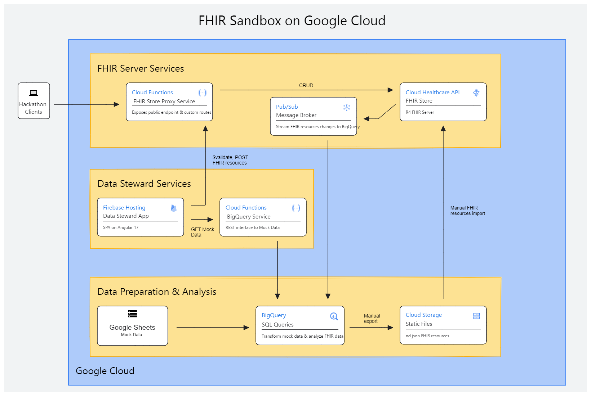

# Background
This project is an end to end guide for spinning up a FHIR sandbox environment in Google Cloud Platform.  In addition to the core FHIR server capabilities this project addresses several common use cases required to support connectathon POCs.

## Use cases to support connetathon POCs
- ability to create and load mock data onto the server with a spreadsheet UI
- public FHIR server (open endpoints)
- ability to extend FHIR server capability by adding custom operations on FHIR resources
- ability to analyze FHIR data with SQL queries
- ability to setup subscriptions (TO DO)
- ability to launch via SMART on FHIR OAuth workflow

## Architecture


# Quick start
Clone repo
```
mkdir my-connectathon-apps \
cd my-connectathon-apps \
git clone https://github.com/dnewingh/gcp-fhir-sandbox-public.git \
cd gcp-fhir-sandbox-public
```

Run deployment scripts.  Authorize Cloud Shell to use your credentials and select y to enable any API services when prompted if not already enabled.
```
bash infra-setup/fhirstore-deploy.sh
```
TODO: Insert instructions for completing FHIR Store configuration via console.
```
bash infra-setup/big-query-deploy.sh
```
```
bash infra-setup/cloud-fns-deploy.sh
```

# Contributing
All are welcome.

# License
MIT

# References
- GCP Architecture Diagramming Tool: https://cloud.google.com/blog/topics/developers-practitioners/introducing-google-cloud-architecture-diagramming-tool
https://stackoverflow.com/questions/47155378/how-can-i-have-multiple-api-endpoints-for-one-google-cloud-function

# General Considerations for a SMART on FHIR simulator
- GCP: easy to spin up Healthcare API but no auth/launcher interface
- smart-launcher: clean interface but only works with smarthealthit public endpoints
    - could possibly substitute with a HAPI server
- Logica sandbox -> distracting EHR launcher
- Epic EHR sandbox -> read-only permissions available

# To Do
- Ng admin app with ability to post/put
    - test if execute bundle preserves resourceId
- Update architecture illustration with Ng data steward app
- Shell script for cli setup and implementation of environment variables
- Blog post